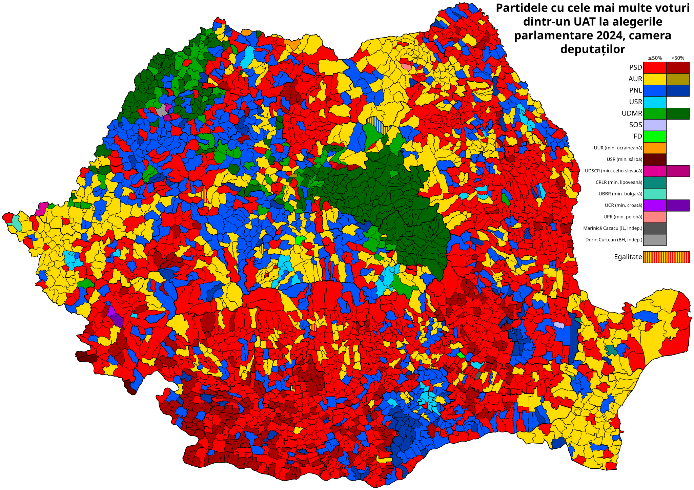

# Generare hărți electorale România

Pe baza datelor din CSV-urile de la [https://prezenta.roaep.ro/](https://prezenta.roaep.ro/), cu scripturi de făcut hărți (SVG cu injectare de CSS) generez hărți electorale.

Fișierele din repository:
- `make_svg.py` - generează la stdout harta UAT-urilor din România pornind de la limite unităților administrativ-teritoriale în format geojson
- scripturi de generare hărți cu rezultate (aproape complet automatizat - nu necesită prelucrare manuală după generare, doar o eventuală bibilire a unor parametrii listați la începutul fișierelor)
    - `make_map.py` - generează harta cu rezultatele prezențelor prelucrând csv-urile
    - `make_map_diff.py` - generează harta cu voturile exprimate târziu (după 21) prelucrând csv-urile
    - `make_winner.py` - generează harta cu câștigătorii per UAT (afișează la stdout un șablon adecvat pentru informațiile despre candidați, indicând ce praguri se văd pe hartă și necesită culori specificate)
- `text-to-path.sh` - convertește textul din svg-uri în căi pentru o randare mai consistentă a acestuia
- `harti` generate prin scripturile de mai sus
- `info-candidati` - informații despre candidații de la un set de alegeri în format csv - folosit de `make_winner.py`. Câmpuri:
    - nume candidat din csv cu informații (fără terminația `-voturi`)
    - culorile folosite, în funcție de prag
    - nume de afișat în legendă
- `info-voturi` - CSV-urile de la ROAEP
- fișiere `.geojson` cu date brute despre UAT-uri
    - cele ce nu sunt cu `wgs84` folosesc coordonate conform `Romania_double_stereo.wkt`
    - bazate pe limitele din [geoportalul ANCPI](https://geoportal.ancpi.ro/portal/apps/webappviewer/index.html?id=faeba2d173374445b1f13512bd477bb2)
    - prelucrate cu QGIS pentru a fi mai „simple” - mai puține puncte
        - nu mai știu exact ce pași le-am aplicat fișierelor fără an în denumire
            - nu au câmpul `countyName`
            - dar cele cu județe au câmpul `judet` cu codul auto al județului
        - las mai jos pașii de prelucrare - folosiți în fișierele cu `2025` în nume - aplicat pe versiunile brute de pe [geoportalul ANCPI](https://geoportal.ancpi.ro/portal/apps/webappviewer/index.html?id=faeba2d173374445b1f13512bd477bb2) cu coordonate conform `Romania_double_stereo.wkt`
            - `v.generalize` din GRASS cu algoritmul *reumann*, *Maximal tolerance value* `500`, *v.in.ogr snap tolerance* `0.0001` (se găsește la *Advanced parameters*)
                - prima simplificare, dă unor UAT-uri mici o formă vizibilă la dimensiunea hărții
            - `v.generalize` din GRASS de 3 ori cu algoritmul *reduction*, *Maximal tolerance value* de `750`, apoi `500`, apoi `250`, *v.in.ogr snap tolerance* `0.0001`
                - simplifică unele chestii ignorate de simplificările precedente
                - aplicăm progresiv aceste valori de toleranță deoarece există granițe de UAT-uri ce nu se simplifică la valori mai mari dar se simplifică la valori mai mici
            - *Dissolve* cu *Dissolve field* `natCode`
            - adăugat județul de care aparține fiecare UAT într-un câmp `countyName`
                - de ex. prin *join* cu date din `info-voturi`
            - eliminat de câmpuri `fid`, `cat`
            - *Dissolve* cu *Dissolve field* `countyName` pentru a obține contururile județelor
